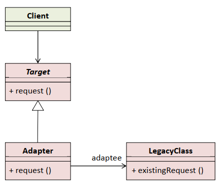
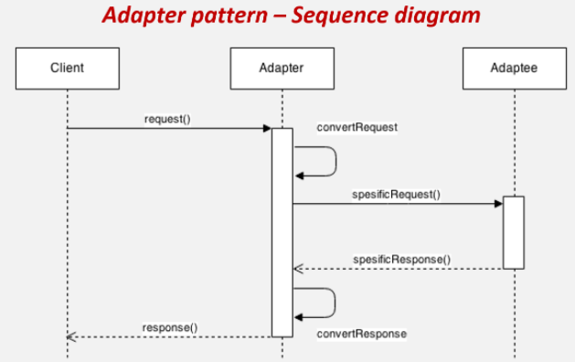
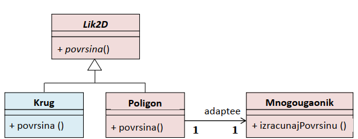

# Adapter - pregovarač, prilagođenje

Obezbjeđuje interfejs između različitih klasa i prilagođava interfejs jedne klase u interfejs kakav očekuje druga klasa, čime omogućava komunikaciju koja inače ne bi mogla da se ostvari.  

  

  
  Client
  - objekat koji zahtjeva interfejs Target  
  
  Target  
  - definiše specifični interfejs koji koristi klasa Client
  
  Adapter  
  - prilagođava postojeći interfejs LegacyClass prema interfejsu klijentske klase
  - realizacija:
     - nasljeđivanje interfejsa: Target <- Adapter
     - delegacija: Adapter -> LegacyClass
   
  LegacyClass (Adaptee)
  - reprezentuje postojeći interfejs koji treba da se prilagodi  
  
    
  
  # Primjer
    
  
