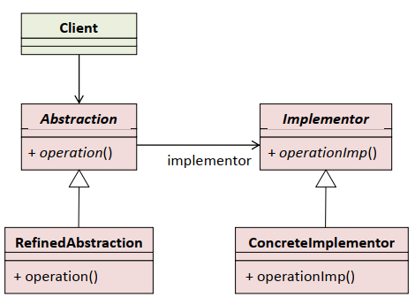
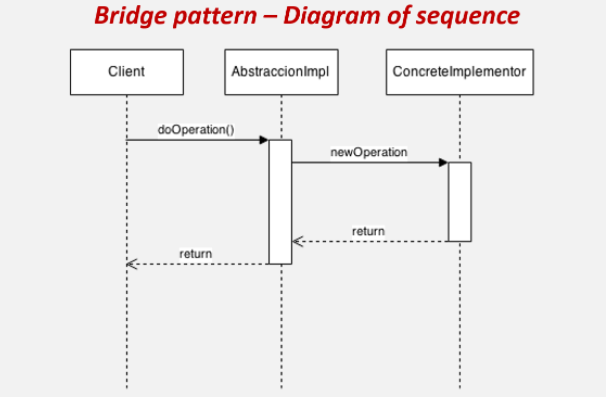

# Bridge - most  
Razdvaja apstrakciju nekog objekta od njegove implementacije i omogućava nezavisne izmjenje interfejsa i implementacije.  
Razdvajanjem apstrakcije i implementacije omogućava da se jedna od više mogućih implementacija dinamički bira i veže za klijentski interfejs.  
Često se naziva i Handle/Body.  
  
Abstraction
- deklariše interfejs apstrakcije
- čuva referencu na objekat implementora

RefinedAbstraction  
- proširuje interfejs koji deklariše klasa Abstraction  
  
Implementor
- deklariše interfejs za implementacione klase
- interfejs ne mora u potpunosti da odgovara interfejsu u Abstraction
- interfejs klase Implementor često sadrži samo primitivne operacije, dok klasa Abstraction definiše operacije višeg nivoa bazirane na tim primitivama
  
ConcreteImplementor
- konkretna implementracija 
  
  
