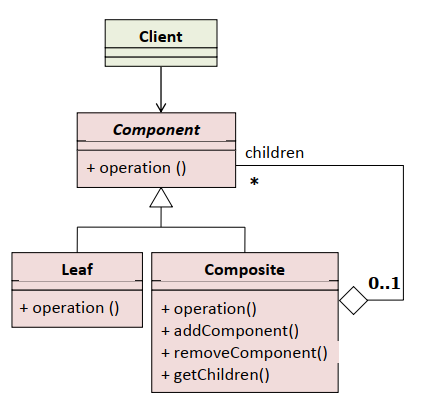
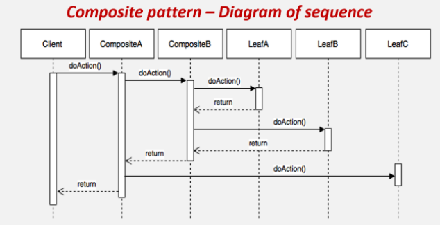
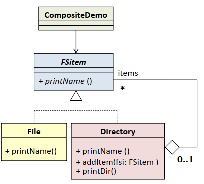

# Composite - kompozicija

Formira složenu hijerarhijsku strukturu proizvoljne širine i dubine i omogućava klijentu da na isti način tretira i proste i složene objekte koji su dio kompleksne strukture  

     
  
 Component
 - deklariše interfejs za objekte u kompoziciji
 - implementira ponašanje zajedničko svim klasama
 - deklariše interfejs za pristup podelementima
 - može da definiše i implementira interfejs za pristup roditeljskom elementu u rekurzivnim strukturama
   
 Leaf
 - reprezuntuje prosti objekat u kompoziciji
 - definiše ponašanje za proste objekte u kompoziciji
   
 Composite
 - definiše ponašanje složenih elemenata
 - čuva podelemente
 - implementira operacije za podelemente iz interfejsa klase Component
  
 Client
 - manipuliše objektiima iz kompozicije kroz interfejs klase Component  
   
     
   
   # Primjer
   
