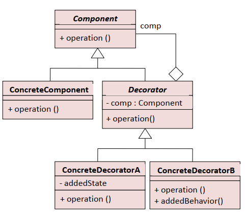
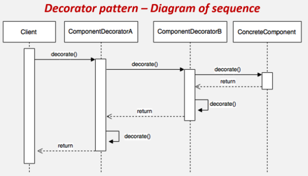

# Decorator - dekorater  
  
Dinamički dodaje uloge objektima i predtsavlja fleksibilan način za unapređenje funkcionalnosti postojećih potklasa.  
  
  
  Component
  - deklariše interfejs za objekte kojima se dinamički mogu dodavati neke funkcionalnosti
  
  ConcreteComponent
  - predstavlja klasu čijim se objektima mogu dinamički dodavati funkcionalnosti
  
  Decorator
  - čuva referencu na objekat klase Component i deklariše interfejs koji se slaže sa interfejsom klase Component
  
  ConcreteDecorator
  - dodaje nove funkcionalnosti komponenti  
    
     
  
  
