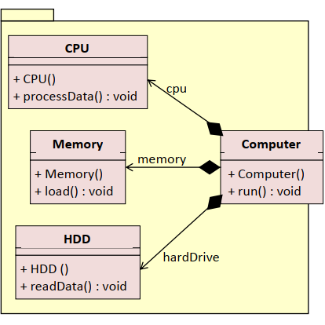

# Facade - fasada  
Obezbjeđuje jednstveni interfejs za cjelokupni podsistem, tj. jedna klasa reprezentuje cijeli sistem.  
  
Fasada 
- definiše interfejs podsistema
- zna koje klase podsistema treba da prihvate spoljne zahtjeve i delegira im pozive spolja
  
Klase u podsistemima
- obrađuju zahtjeve koje delegira fasada
- ne sadrže nikakvu referencu na fasadu
  
   
# Primjer
  
