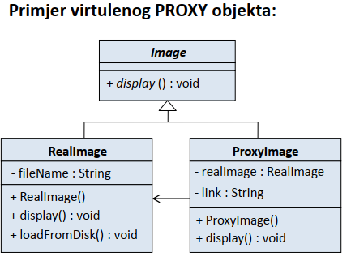

# Proxy - poslanik  
Obezbjeđuje surogat za objekat koji treba biti kontrolisan, to je objekat koji reprezentuje drugi objekat.

Subject
- definiše zajednički interfejs za klase RealSubject i Proxy, kako bi Proxy mogao biti upotrijebljen svuda gde se očekuje RealSubject

RealSubject
- definiše realne objekte koje reprezentuje Proxy objekat

Proxy
- čuva referencu na RealSubject koja mu omogućava pristup RealSubject objektu
- obezbjeđuje interfejs identičan interfejsu klase Subject (u protivnom Proxy ne može da zamijeni Subject)
- vodi računa o pristupu instanci klase RealSubject i može biti odgovoran za njegovo kreiranje i brisanje

 

# Primjene Proxy šablona  
Remote proxy
- proxy objekat lokalno reprezentuje objekat koji se nalazi u drugom adresnom prostoru
- dobar ako se informacije ne mijenjaju često

Virtual proxy
- realni objekat je „preskup” da bi se instancirao ili download-ovao
- dobar ako se realnom objektu ne pristupa često

Protection proxy
- štiti realan objekat od neovlaštenog pristupa  

   

   

 
